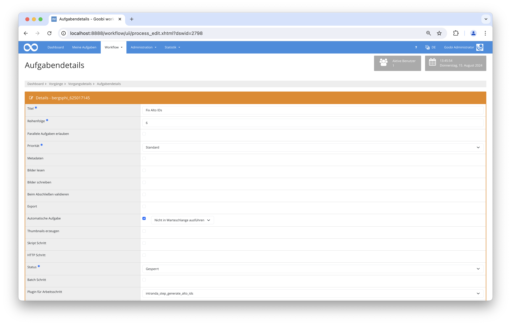

## Einführung
Diese Dokumentation erläutert das Plugin zur Generierung von ALTO IDs.

## Installation
Um das Plugin nutzen zu können, müssen folgende Dateien installiert werden:

```bash
/opt/digiverso/goobi/plugins/step/plugin-step-generate-alto-ids-base.jar
```

Nach der Installation des Plugins kann dieses innerhalb des Workflows für die jeweiligen Arbeitsschritte ausgewählt und somit automatisch ausgeführt werden. Ein Workflow könnte dabei beispielhaft wie folgt aussehen:


Für die Verwendung des Plugins muss dieses in einem Arbeitsschritt ausgewählt sein:




## Überblick und Funktionsweise
Beim Starten des Plugins werden alle ALTO Dateien auf fehlende IDs geprüft.
Sollten fehlende IDs gefunden werden, wird zuerst ein Backup aller OCR Ergebnisse mitsamt der ALTO Dateien erstellt.
Danach werden die fehlenden ALTO IDs in allen Dateien ergänzt.


## Konfiguration
Dieses Plugin erfordert keine Konfiguration.
